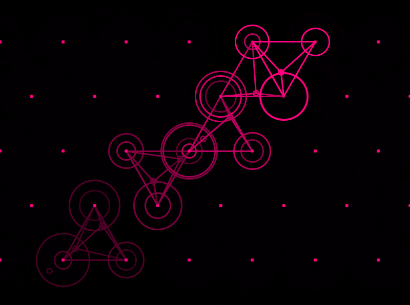
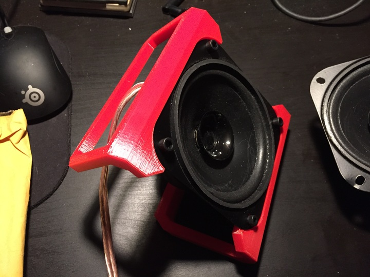
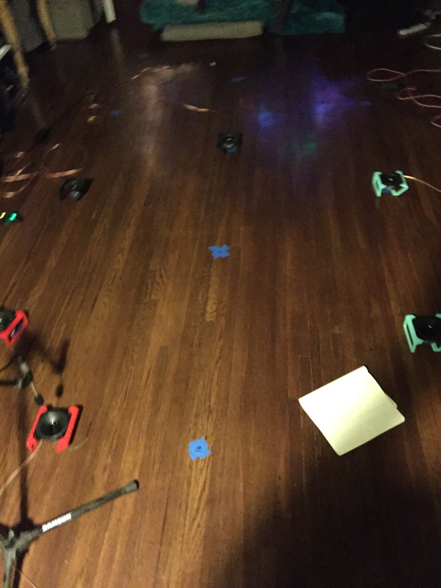

# ethel-agnes-vera

This is a spatialized live performance that involves three Raspberry Pis and six speakers. Each Raspbery Pi is connected to two speakers, and only require a wireless router and power to receive control parameters from a central computer. This allows for easy movement of the speakers throughout the performance.

The speakers are arranged according to a map of connecting equilateral triangles. Manifold Interface Amplitude Panning (MIAP) can use this grid of triangles to create gain calculations based on a point in the grid and it's relation to the points of the triangle it is in.

The performer in this piece moves the speakers to various nodes in accordance to the changing spatial parameters, as the piece gradually shifts between nodes, human interaction is required to keep the spatial intent, but also allows unpredictable flaws to emanate from the system.

The sound source used is a computer voice repeating three names that correspond to the titles of the Raspbery Pis themselves, in this case `ethel`, `agnes`, and `vera`.

The ultimate goal for this piece would be to have it in a large enough space to allow the audience to remain within the changing nodes, allowing for more human intrusion into the system.

An example of a point moving from the lower left corner of a five by seven grid of nodes. The circles represent the nodes and their radius represents their gain value.

A custom set of speakers are used, with 3d printed speaker-enclosures.

A tentative setup for the piece.
