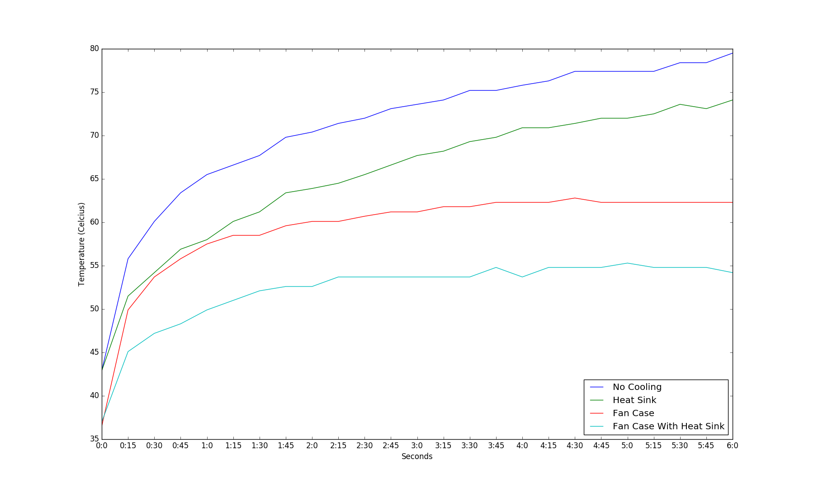

# Results

The Pis overheated in the original performance, so I designed a case that allows for air to flow over the amp and the Pi processor, there's also a heat sink over the Broadcom chip and the processor to add a bit more cooling.

